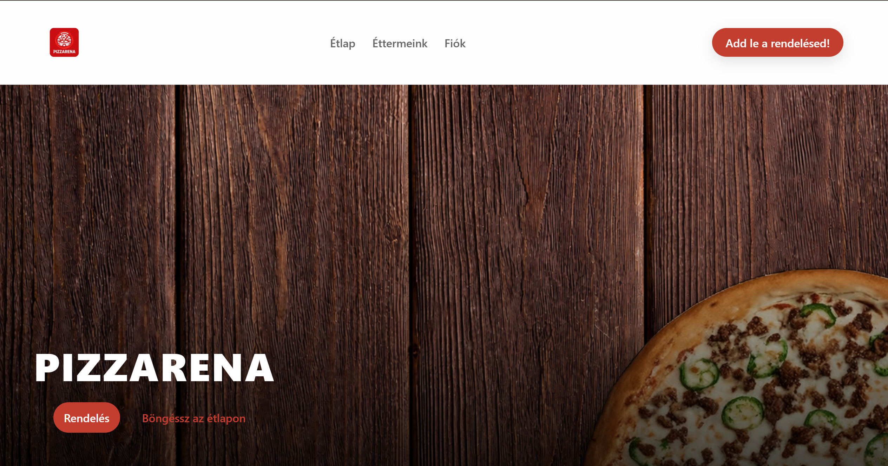
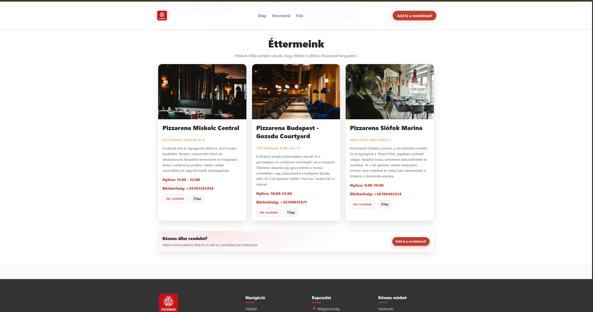
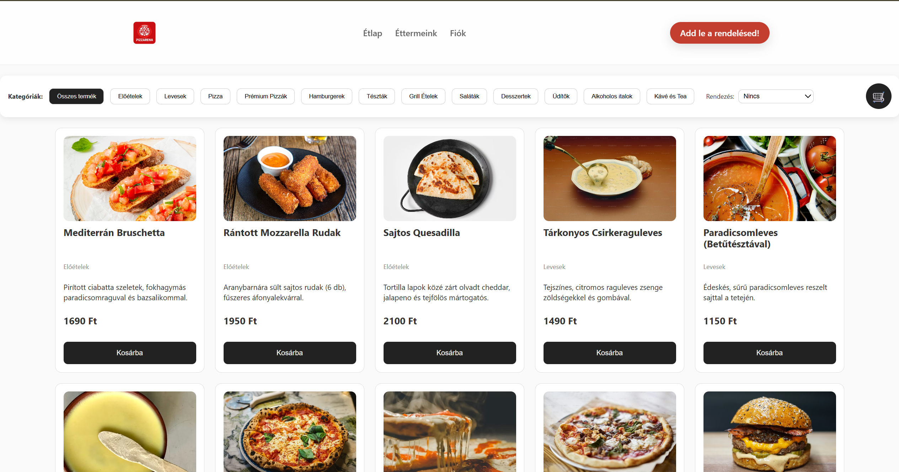
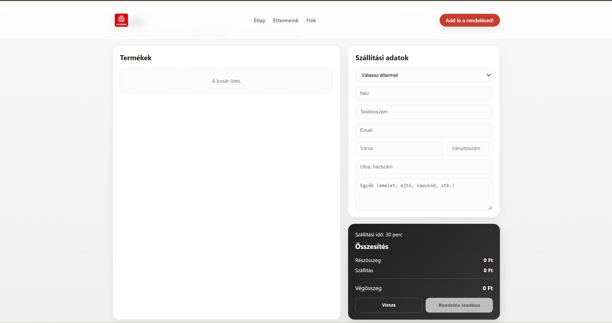
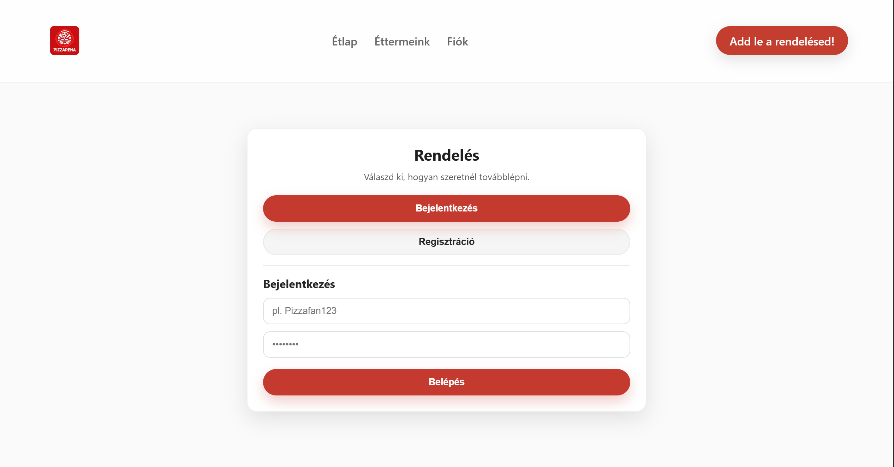

**Itt található a frontend forráskódja, a hozzá tartozó tesztek, valamint a Python Selenium webdriver tesztek is!**

# PizzAréna Weboldal

Modern online ételrendelő rendszer, ahol a felhasználók több étterem kínálatából választhatnak, kosárba helyezhetik a termékeket, majd egyszerűen leadhatják rendelésüket.

## Főbb működési elemek

* Ételek listázása kategóriák szerint
* Kategóriák közötti navigáció
* Kosárba helyezés és kosárfrissítés
* Bejelentkezés és felhasználói fiók kezelés
* Rendelések véglegesítése
* Fiók dashboard
* Rendelési állapot megjelenítése

# Oldalak

### Kezdőlap
A kezdőlap a weboldal fő belépési pontja, ahol a látogatók gyors áttekintést kapnak a szolgáltatásról, az elérhető éttermekről és a rendelési lehetőségekről.

---

### Rólunk
A Rólunk oldal bemutatja a PizzAréna rendszer célját, működését és a platform fő előnyeit.

---

### Étlap
Az Étlap oldalon a felhasználók böngészhetnek az elérhető ételek között, éttermek és kategóriák szerint.

---

### Kosár
A Kosár oldalon a kiválasztott termékek jelennek meg, ahol lehetőség van a mennyiség módosítására, illetve a tételek eltávolítására is. A felhasználó véglegesítheti a kiválasztott termékeket és leadhatja megrendelését.

---

### Fiók oldal
A fiók oldalon a felhasználók bejelentkezhetnek, illetve hozzáférhetnek saját profiljukhoz és rendeléseikhez.

## Éttermek
A rendszer jelenleg 3 különböző éttermet kezel.

---

## Használt technológiák

* React (Frontend)
* CSS
* JavaScript
* REST API
* Python & Selenium (E2E Tesztelés)

---

# PizzAréna Github linkje: 
[https://github.com/Ballam906/PizzArena](https://github.com/Ballam906/PizzArena)
